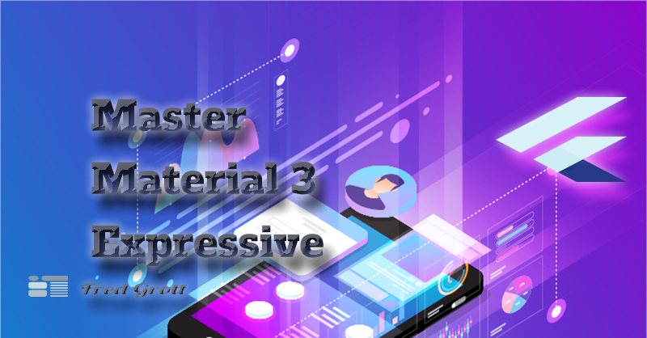

# Master Material 3 Expressive

So, I'm not waiting until late 2025 to get M3E. As it can be in fact implemented now with no fuss

In this repo is the material design 3 demo app base started with and the steps to get 
full M3E. The articles describing the techniques can be found at my substack:

[Fred Grotts Flutter Newsletter](https://fredgrott.substack.com)

## Liquid Glass

The dynamic aspect of Liquid Glass is expected to be tackled by the Flutter
Impeller Engine team. However, one can simulate an Apple corrected guassian 
blur currently with no shaders required. See the liguid glass demo app source
for details, which you will find in the steps_to_m3e folder.

## Material Shapes

Material Shapes in Material 3 Expressive replaces animated icons in MD3. Basically,
Google uses the curve point technique used in Fonts to represent shapes that
can easily animated to morph into another Material Shape.

https://raw.githubusercontent.com/fredgrott/master_material_3_expressive/master/media/material-shapes-demo.mp4

## Resources

The Material 3 Expressive guide by Google is here:

https://m3.material.io/blog/building-with-m3-expressive

