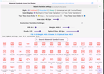

# Master Material 3 Expressive

So, I'm not waiting until late 2027 to get M3E. As it can be in fact implemented now with no fuss.
Keep in mind as of now(before Material and Cupertino get separated to different packages) that 
we use the Material Design system and use Flex Color Scheme to adapt to other OS platforms.

In this repo is the material design 3 demo app base started with and the steps to get 
full M3E. The articles describing the techniques can be found at my substack:

[Fred Grotts Flutter Newsletter](https://fredgrott.substack.com)

## M3E Accessories

Indirectly implied by the M3E spec but not in the Flutter SDK

### Material Symbols

Includes how to use the 3rd party Material_Symbol_Icon package. Source is in  this subfolder:

[Material Symbol Icon Demo](./m3e_accessories/material_symbols-demo)

The article includes how to get the two tone variants of icons whichs is brand new to the spec.The 
article is at:

### Material Motion Via the Motor Package

### Material Shapes

### Heroine Powered by the Motor Package

### Varianle Fonts via Google_Fonts package

### Design Tokens via the Mix Package

### BlurBox

### FlexColorScheme

### Flutter Animate

### Dynamic Color

## M3E Components

None of these are in the Flutter SDK yet.

### The Better M3E Carousel

### Split Button

### Button Groups

### FAB Menu

### Toolbar

### Canonical Layouts

### Flex Sxaffold

## License

BSD-Clause-3, copyright Fredrick Allan Grott 2025.

## Resources

The Material 3 Expressive guide by Google is here:

https://m3.material.io/blog/building-with-m3-expressive

